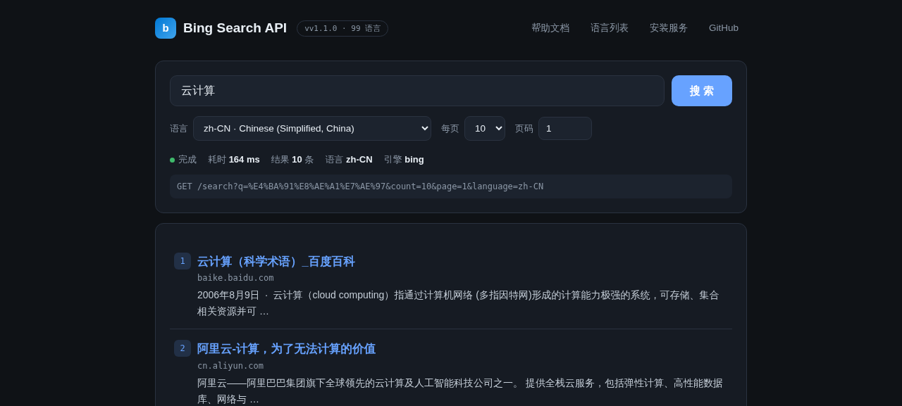
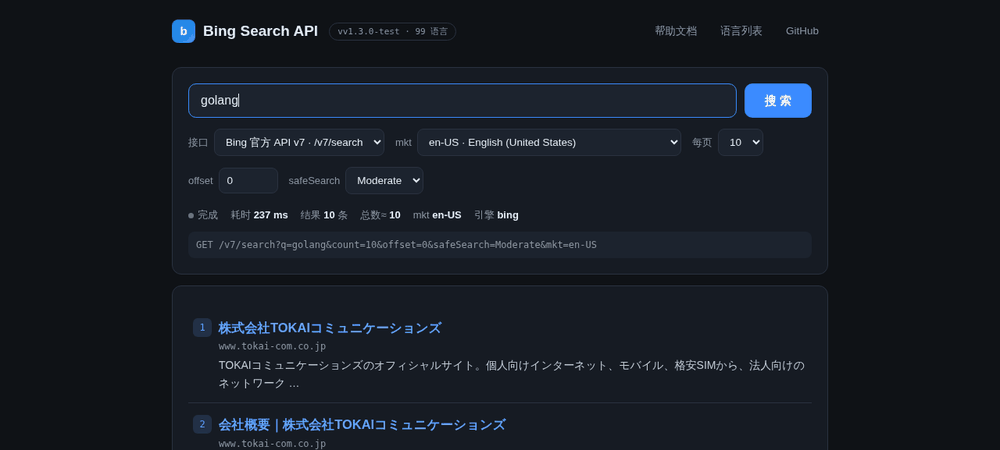
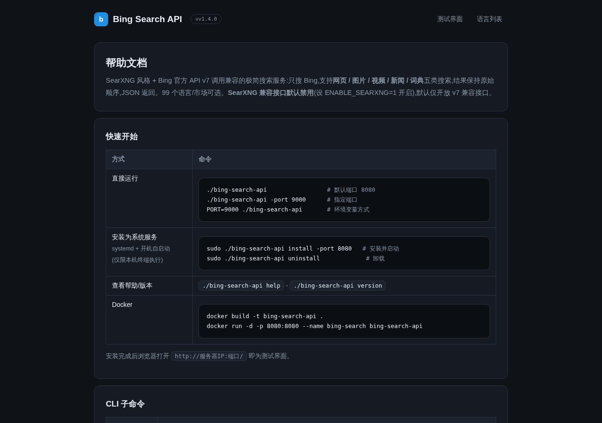
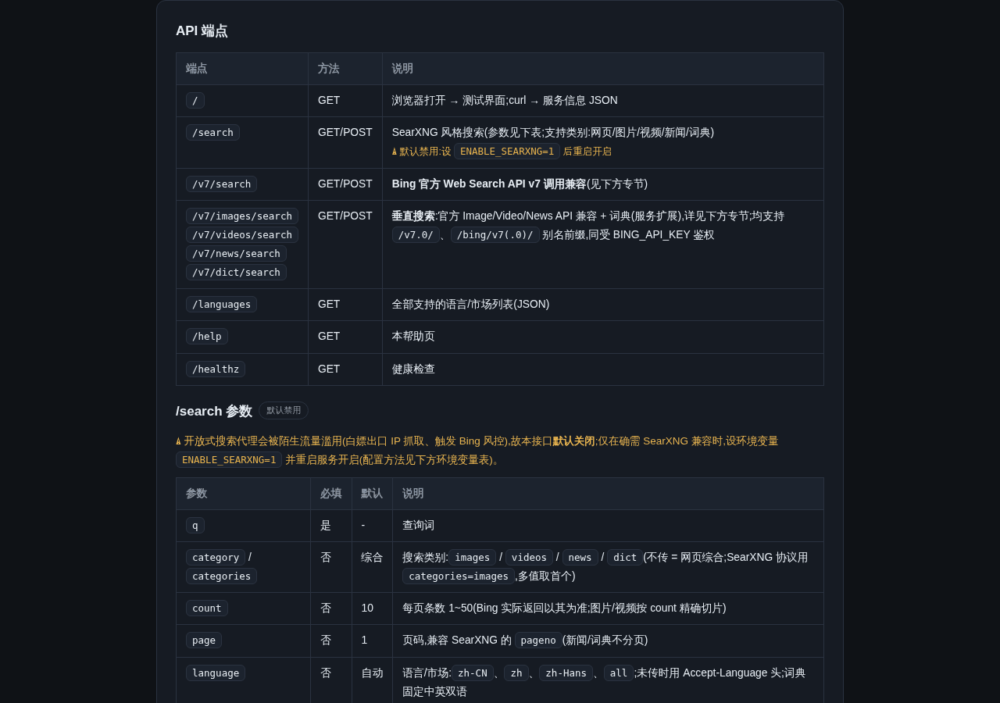

# bing-search-api

用 Go 编写的极简搜索 API:**只搜索 Bing**,拿到结果后**不做任何重新排序、去重或聚合**,按 Bing 结果页的原始顺序整理成 JSON 返回。同时提供两套调用接口:

- **`/v7/search`** — **全面兼容微软官方 Bing Web Search API(v7) 调用协议**(默认启用):官方参数、官方响应结构、官方错误格式、`Ocp-Apim-Subscription-Key` 鉴权头,存量代码改个 base URL 即可继续工作
- **`/search`** — SearXNG 风格 JSON,`language` 参数用法与 SearXNG 一致;**出于安全考虑默认禁用**,须设 `ENABLE_SEARXNG=1` 显式开启(详见下方说明)

适合需要自建轻量搜索代理、给小工具/脚本/前端提供搜索能力的场景,也适合承接官方 Bing Search API 退役(2025-08-31)后的迁移需求。






## 特性

- 单一引擎:Bing(网页结果)
- 原样返回:结果顺序与 Bing 完全一致,不重排、不去重、不打分
- **安全默认**:SearXNG 兼容接口 `/search` 默认禁用(设 `ENABLE_SEARXNG=1` 开启),v7 兼容接口可选 `BING_API_KEY` 密钥鉴权——开箱即用时暴露面最小
- SearXNG 风格的 JSON 响应结构,方便从 SearXNG 平滑迁移
- **Bing 官方 API v7 调用兼容**(`/v7/search`):q/count/offset/mkt/setLang/safeSearch/responseFilter 全套官方参数,`SearchResponse` 官方响应结构,官方 `ErrorResponse` 错误格式,覆盖官方两代路径(`/v7/search`、`/bing/v7.0/search` 等 4 个别名)
- **全量语言支持:70 种语言 / 99 个市场**,通过 `language` 参数筛选,行为与 SearXNG 相同
- **Web 测试界面**:浏览器打开 `/` 即可搜索,接口模式(SearXNG / 官方 v7)/语言/分页/safeSearch 可选,实时查看 JSON 与 curl 命令
- **一键安装为 systemd 服务**:`sudo bing-search-api install` 自动注册服务 + 开机自启 + 崩溃自动重启(**仅限本机 CLI,Web 端不提供任何安装入口**)
- **帮助文档**:`bing-search-api help`(终端)与 `/help`(网页)
- `GET /languages` 枚举全部可用语言/市场
- 未指定语言时自动使用请求的 `Accept-Language` 头
- 自动还原 Bing `/ck/a` 重定向为真实 URL
- 支持 GET / POST(表单与 JSON)、分页、每页条数;v7 兼容端点支持 offset 多页聚合(最多 6 次抓取)
- 零第三方依赖,仅 Go 标准库,单二进制部署
- 提供全平台发行版(Linux / macOS / Windows × amd64 / arm64 / 386)与 Dockerfile
- 单元测试 21 项:解析、语言解析、重定向解码、v7 参数校验/响应组装/错误格式、SearXNG 开关门禁

## 从官方 Bing Web Search API 迁移(v7 兼容)

微软已于 **2025-08-31 退役官方 Bing Search API(v7)**。如果你的代码(Azure SDK、教程、脚本、第三方库)还在按官方协议调用,把 base URL 换成本服务即可:

```diff
- https://api.bing.microsoft.com/v7/search
- https://api.cognitive.microsoft.com/bing/v7.0/search
+ http://your-server:8080/v7/search          # 或任一等价别名
```

兼容性清单:

| 官方要素 | 本服务行为 |
| -------- | ---------- |
| 参数 `q / count / offset / mkt / setLang / safeSearch / responseFilter` | 完全支持,校验规则同官方(count 1~50、offset 0~9000、safeSearch 三档) |
| 参数 `freshness / textDecorations / textFormat / enableEntities …` | 接受但忽略(直接报错会破坏存量客户端) |
| 鉴权头 `Ocp-Apim-Subscription-Key` | 可选:设 `BING_API_KEY` 环境变量后启用校验(401 返回官方格式);不设则开放 |
| 响应 `SearchResponse`: `queryContext` / `webPages` / `relatedSearches` | 结构与字段名逐一对齐,含 `webSearchUrl`、`totalEstimatedMatches`、`value[].id/name/url/displayUrl/snippet/…` |
| 响应 `ErrorResponse`: `errors[].code/subCode/message/parameter` | 完全一致(400 参数错误、401 密钥错误、502 上游失败) |
| 路径 `/v7/search` 与 `/bing/v7.0/search` | 4 个等价别名全覆盖 |

兼容边界(诚实声明):仅实现网页类答案(webPages + relatedSearches);`totalEstimatedMatches` 取自 SERP 计数条,解析不到时以已知结果数兜底;`setLang` 接受但按官方语义不影响结果。

## 快速开始

### 从发行版安装(推荐)

从 [Releases](https://github.com/cshdotcom/bing-search-api/releases) 下载对应平台的压缩包:

| 平台 | 文件 |
| ---- | ---- |
| Linux amd64 / arm64 / 386 | `bing-search-api_<ver>_linux_<arch>.tar.gz` |
| macOS amd64 / arm64 | `bing-search-api_<ver>_darwin_<arch>.tar.gz` |
| Windows amd64 / 386 / arm64 | `bing-search-api_<ver>_windows_<arch>.zip` |

```bash
sha256sum -c SHA256SUMS                # 校验完整性
tar xzf bing-search-api_v1.3.0_linux_amd64.tar.gz
cd bing-search-api_v1.3.0_linux_amd64
./bing-search-api -port 9000           # 直接运行,指定端口
sudo ./bing-search-api install -port 9000   # 或安装为 systemd 服务(开机自启)
```

### 安装为 systemd 服务(开机自启动)

> ⚠️ 必须在**服务器本机终端**执行以下命令(sudo 密码即鉴权);安装能力从不暴露在 HTTP 端口上。

```bash
sudo ./bing-search-api install            # 默认端口 8080
sudo ./bing-search-api install -port 9000 # 指定端口
sudo ./bing-search-api uninstall          # 卸载
```

`install` 会自动:

1. 复制二进制到 `/usr/local/bin/bing-search-api`
2. 写入 systemd 单元 `/etc/systemd/system/bing-search-api.service`(**沙箱加固**:动态非特权用户运行、文件系统只读,老版本 systemd 自动退回兼容单元)
3. `daemon-reload` → `enable`(开机自启)→ `restart`(立即启动)

安装完成后:

```bash
systemctl status bing-search-api          # 服务状态
journalctl -u bing-search-api -f          # 跟踪日志
```

浏览器打开 `http://服务器IP:端口/` 即为测试界面。

> 无 systemd 的环境(容器/WSL1)会给出明确提示,改用直接运行或 Docker 即可。

### 从源码运行

```bash
go run .                                    # 默认监听 :8080
go run . -port 9000                         # 命令行指定端口
PORT=9000 go run .                          # 环境变量指定端口
BING_BASE=https://cn.bing.com go run .      # 使用国内版入口(可选)
make build                                  # 或用 Makefile 编译
```

### Docker

```bash
docker build -t bing-search-api .
docker run -d -p 8080:8080 --name bing-search bing-search-api
```

## CLI 用法

| 命令 | 说明 |
| ---- | ---- |
| `bing-search-api` | 前台启动 HTTP 服务(默认) |
| `bing-search-api -port 9000` | 指定端口启动(参数写在子命令前后均可) |
| `bing-search-api install` | 安装为 systemd 服务并设开机自启(非 root 自动 sudo 提权;`-no-start` 只注册不启动;**仅限本机终端执行,Web 端无安装入口**) |
| `bing-search-api uninstall` | 卸载 systemd 服务与二进制 |
| `bing-search-api help` | 终端打印帮助 |
| `bing-search-api version` | 打印版本号 |

通用参数:`-port N`(默认 8080,或环境变量 PORT)、`-host IP`(默认 0.0.0.0)、`-bing URL`(Bing 入口)。

## Web 界面

| 路径 | 说明 |
| ---- | ---- |
| `/` | 测试界面:搜索框 + 接口模式切换(SearXNG `/search` / 官方 v7 `/v7/search`,mkt、safeSearch、offset 自适应;服务端禁用 SearXNG 接口时自动锁定 v7 模式并提示)+ 语言下拉(全部 99 个市场,自动跟随浏览器语言)+ 分页,实时展示结果、相关搜索、原始 JSON 与可复制的 curl 命令(curl 访问 `/` 仍返回 JSON 服务信息,两种视图互不干扰) |
| `/help` | 帮助文档页:快速开始、两套 API 参数、语言规则、systemd 管理命令、安全设计 |

> v1.1.0 曾提供过 `/install` 网页安装向导,v1.1.1 出于安全考虑已全部移除,安装仅限本机 CLI。





## API

### GET /search(SearXNG 兼容,默认禁用)

> ⚠️ **出于安全考虑,本接口默认关闭**:无鉴权的开放搜索代理会被陌生流量滥用——匿名白嫙你的出口 IP 抓 Bing、高频调用触发风控连坐。仅在确需 SearXNG 兼容时,设环境变量 `ENABLE_SEARXNG=1` 并重启服务开启(配置方法见下方「配置」)。未开启时调用返回 403 与开启指引;`/v7/search` 不受影响。

| 参数 | 必填 | 默认 | 说明 |
| ---- | ---- | ---- | ---- |
| q | 是 | - | 查询词 |
| count | 否 | 10 | 每页条数,1~50(传给 Bing 的提示值,Bing 实际返回条数以它为准) |
| page | 否 | 1 | 页码,从 1 开始(兼容 SearXNG 的 `pageno`) |
| language | 否 | 自动 | 语言/市场,如 `zh-CN`、`en`、`zh-Hans`、`all`,详见下方语言支持 |
| format | 否 | - | 仅为兼容 SearXNG 保留,传任何值都返回 JSON |

```bash
ENABLE_SEARXNG=1 ./bing-search-api     # 启动时开启(或 systemd drop-in,见配置章节)

curl "http://localhost:8080/search?q=golang&count=5&page=1"      # 开启后可用
curl "http://localhost:8080/search?q=云计算&language=zh-CN&count=10"
```

### POST /search

支持表单或 JSON 两种方式:

```bash
curl -X POST http://localhost:8080/search \
     -H "Content-Type: application/json" \
     -d '{"q":"openai","count":5,"page":2,"language":"en-US"}'

curl -X POST http://localhost:8080/search -d "q=golang&page=2&language=de"
```

### GET|POST /v7/search(Bing 官方 API v7 兼容)

请求参数与官方 Bing Web Search API(v7)一致:

| 参数 | 必填 | 默认 | 说明 |
| ---- | ---- | ---- | ---- |
| q | 是 | - | 查询词(POST 可用 JSON body 传,优先级高于查询串) |
| count | 否 | 10 | 返回条数 1~50,不足时自动多页聚合(最多 6 次抓取) |
| offset | 否 | 0 | 0 基结果偏移,0~9000(官方语义,与 `/search` 的 page 不同) |
| mkt | 否 | 自动 | 市场,如 `en-US`、`zh-CN`;非法值返回官方 400 格式 |
| safeSearch | 否 | Moderate | `Off` / `Moderate` / `Strict`;Strict 映射 Bing `adlt=strict` |
| responseFilter | 否 | - | 答案类型过滤,支持 `Webpages`、`RelatedSearches`(逗号分隔) |
| setLang | 否 | - | 接受但忽略(官方语义仅影响界面字符串) |

```bash
curl "http://localhost:8080/v7/search?q=golang&count=25&offset=50&mkt=en-US"

curl -X POST http://localhost:8080/v7/search \
     -H "Content-Type: application/json" \
     -d '{"q":"openai","count":30,"offset":0,"mkt":"en-US","safeSearch":"Strict"}'

# 带密钥(BING_API_KEY=xxx 时启用校验)
curl "http://localhost:8080/v7/search?q=golang" -H "Ocp-Apim-Subscription-Key: xxx"
```

响应为官方 `SearchResponse` 结构:

```json
{
  "_type": "SearchResponse",
  "queryContext": {"originalQuery": "golang", "adultIntent": false},
  "webPages": {
    "webSearchUrl": "https://www.bing.com/search?q=golang&mkt=en-US",
    "totalEstimatedMatches": 7140000,
    "value": [
      {
        "id": "https://api.bing.microsoft.com/api/v7/#WebPages.0",
        "name": "The Go Programming Language",
        "url": "https://go.dev/",
        "displayUrl": "https://go.dev/",
        "snippet": "Get Started Playground Tour ...",
        "language": "en-US",
        "isFamilyFriendly": true,
        "isNavigational": false
      }
    ]
  },
  "relatedSearches": {
    "id": "https://api.bing.microsoft.com/api/v7/#RelatedSearches",
    "value": [{"text": "golang tutorial", "displayText": "golang tutorial", "webSearchUrl": "..."}]
  }
}
```

错误为官方 `ErrorResponse` 结构:

| 状态码 | 场景 | 官方错误码 |
| ------ | ---- | ---------- |
| 400 | 缺 q / 参数非法 / mkt 不支持 | `InvalidRequest` + `ParameterMissing`/`ParameterInvalid` |
| 401 | `BING_API_KEY` 已设但密钥不匹配 | `UnauthorizedAccess` |
| 405 | 方法不支持 | `InvalidRequest` |
| 502 | Bing 抓取失败/被限流 | `ServerError` + `UnexpectedError` |

```json
{"_type":"ErrorResponse","errors":[{"code":"InvalidRequest","subCode":"ParameterInvalid",
  "message":"count 必须是 1~50 的整数","parameter":"count","value":"99"}]}
```

等价别名(覆盖官方两代路径):`/v7.0/search`、`/bing/v7/search`、`/bing/v7.0/search`。

## 语言支持(与 SearXNG 相同)

`language` 参数的取值与行为和 SearXNG 保持一致,共支持 **70 种语言 / 99 个市场**:

| 写法 | 含义 | 示例 |
| ---- | ---- | ---- |
| `语言-地区` | 完整市场,映射到 Bing 的 `mkt` 参数 | `language=zh-CN`、`language=en-GB` |
| `语言` | 该语言,自动选择默认市场 | `language=zh` → zh-CN,`language=pt` → pt-BR |
| `别名` | 常见别名与旧代码自动归一化 | `zh-Hans` → zh-CN,`es-419` → es-MX,`in` → id-ID |
| `all` | 不限语言 | `language=all` |
| 不传 | 自动:按 `Accept-Language` 请求头,无头则由 Bing 判断 | - |

大小写与分隔符不敏感(`ZH_cn`、`zh_cn` 均可);语言可识别但地区未知时回落到该语言的默认市场(如 `de-XX` → de-DE);完全不认识的语言返回 400 并提示可用列表。

```bash
curl "http://localhost:8080/search?q=news&language=ja-JP"
curl "http://localhost:8080/search?q=nachrichten&language=de"
curl -H "Accept-Language: fr-FR" "http://localhost:8080/search?q=actualites"
curl "http://localhost:8080/search?q=news&language=all"
```

### GET /languages

枚举全部支持的语言/市场,供客户端动态渲染语言选择器:

```bash
curl http://localhost:8080/languages | python3 -m json.tool
```

```json
{
  "count": 99,
  "special": ["all", "auto"],
  "languages": [
    {"code": "zh-CN", "language": "zh", "name": "Chinese (Simplified, China)", "default": true},
    {"code": "zh-TW", "language": "zh", "name": "Chinese (Traditional, Taiwan)"},
    {"code": "ja-JP", "language": "ja", "name": "Japanese (Japan)", "default": true}
  ],
  "usage": "/search?q=example&language=zh-CN"
}
```

### 响应

```json
{
  "query": "golang",
  "language": "all",
  "number_of_results": 5,
  "results": [
    {
      "title": "The Go Programming Language",
      "url": "https://go.dev/",
      "content": "Get Started Playground Tour Stack Overflow Help ...",
      "engine": "bing",
      "engines": ["bing"],
      "score": 1.0,
      "position": 1
    }
  ],
  "answers": [],
  "corrections": [],
  "infoboxes": [],
  "suggestions": [],
  "unresponsive_engines": []
}
```

- `results` 顺序与 Bing 结果页完全一致,`position` 即原始位次
- `language` 为实际生效的语言(市场代码或 `all`)
- `content` 为 Bing 给出的摘要文本
- `suggestions` 为 Bing 底部"相关搜索"(如有)

### 错误

| 状态码 | 场景 | 示例 |
| ------ | ---- | ---- |
| 400 | 缺少 q 参数 | `{"error":"缺少查询参数 q"}` |
| 400 | 不支持的语言 | `{"error":"不支持的语言 \"xx\":共支持 99 个语言/市场(完整列表见 GET /languages)..."}` |
| 403 | 未设 ENABLE_SEARXNG(默认禁用) | `{"error":"SearXNG 兼容接口已禁用(默认):如需开启,设环境变量 ENABLE_SEARXNG=1 后重启服务;..."}` |
| 405 | 方法不支持 | `{"error":"仅支持 GET / POST"}` |
| 502 | Bing 抓取失败/被限流 | `{"error":"Bing 查询失败: ..."}` |

### 其他端点

- `GET /v7/search` Bing 官方 API v7 兼容(见上节,含 4 个路径别名)
- `GET /languages` 全部支持的语言/市场列表
- `GET /help` 帮助文档页(浏览器打开)
- `GET /healthz` 健康检查
- `GET /` 测试界面(浏览器)/ 服务信息 JSON(curl)

## 安全设计

- **安装/卸载仅限本机 CLI**:必须在服务器终端执行 `sudo bing-search-api install`,sudo 密码即鉴权。HTTP 端口无鉴权,因此 Web 端**不存在任何安装入口**——无鉴权的网页安装按钮会直接变成“远程改写系统配置”的后门(v1.1.0 曾提供的 `/install` 网页向导已在 v1.1.1 移除)
- **服务进程非特权运行**:systemd 单元默认沙箱加固——动态非特权用户(DynamicUser)、文件系统只读、禁设备/内核写入、内存 W^X,仅保留低端口绑定能力;即使服务进程被攻破也无法改动系统配置或提权。老版本 systemd(如 CentOS 7)不支持时会自动退回兼容单元
- **SearXNG 兼容接口默认禁用**(v1.3.0 起):`/search` 是无鉴权开放接口,公网上任何人都可把它当匿名搜索代理滥用(白嫙出口 IP、风控连坐),因此默认返回 403,须设 `ENABLE_SEARXNG=1` 显式开启;`/v7/*` 兼容端点可选 `BING_API_KEY` 密钥鉴权(配置方法见「配置」)
- **搜索 API 暴露面可控**:开箱即用时仅 `/v7/search`(建议配密钥)+ `/languages` + `/help` + `/healthz` 可访问;`/search` 等如需对更多人开放,建议前置反代加 BasicAuth / IP 白名单
- 部署在公网时,请用防火墙/安全组控制暴露面,并合理限流避免 Bing 风控

## 配置

| 环境变量 | 默认值 | 说明 |
| -------- | ------ | ---- |
| `PORT` | `8080` | 监听端口(命令行 `-port` 优先) |
| `HOST` | `0.0.0.0` | 监听地址(命令行 `-host` 优先) |
| `BING_BASE` | `https://www.bing.com` | Bing 入口,可换成 `https://cn.bing.com` |
| `ENABLE_SEARXNG` | 关 | **SearXNG 兼容接口 `/search` 开关**:设 `1`(或 true/yes/on)开启;不设则该接口返回 403(安全考虑,见下节) |
| `BING_API_KEY` | 空 | 设置后 `/v7/*` 要求 `Ocp-Apim-Subscription-Key` 头(或 `subscription-key` 参数)与之匹配;不设则开放访问 |

### SearXNG 兼容接口开关(ENABLE_SEARXNG,默认关)

`/search` 是无鉴权的 SearXNG 风格开放接口,部署在公网时任何知道地址的人都能把你的服务当**匿名搜索代理**用:流量耗在别人身上、Bing 风控连坐到你的出口 IP。因此 v1.3.0 起**默认关闭**,仅在确需 SearXNG 兼容时显式开启:

```bash
# 1) 直接运行
ENABLE_SEARXNG=1 ./bing-search-api

# 2) systemd 服务:drop-in 追加,不改动主单元(升级服务不丢配置)
sudo systemctl edit bing-search-api
#   在编辑器中加入(保存退出):
#   [Service]
#   Environment=ENABLE_SEARXNG=1
sudo systemctl restart bing-search-api
journalctl -u bing-search-api -n 5    # 日志出现"SearXNG 兼容,已启用"即生效

# 3) Docker
docker run -d -p 8080:8080 -e ENABLE_SEARXNG=1 bing-search-api
```

未开启时访问 `/search` 返回 403 与开启指引;`/v7/search`、`/languages`、`/help`、`/healthz` 不受影响。公网部署建议同时设置 `BING_API_KEY`,并配合反代限制访问。

### 可选鉴权:BING_API_KEY 配置方法(v7 兼容端点)

设置 `BING_API_KEY` 环境变量后,`/v7/*` 端点要求官方 `Ocp-Apim-Subscription-Key` 鉴权;不设置则完全开放。密钥在服务**启动时从环境变量读取**,不写入任何配置文件,按部署方式选择:

```bash
# 1) 直接运行
BING_API_KEY=你的密钥 ./bing-search-api -port 8080

# 2) systemd 服务:用 drop-in 追加,不改动主单元(升级服务也不会丢配置)
sudo systemctl edit bing-search-api
#   在编辑器中加入(保存退出):
#   [Service]
#   Environment=BING_API_KEY=你的密钥
sudo systemctl restart bing-search-api
journalctl -u bing-search-api -n 5    # 日志出现"已启用密钥鉴权"即生效

# 3) Docker
docker run -d -p 8080:8080 -e BING_API_KEY=你的密钥 bing-search-api

# 4) 从源码
BING_API_KEY=你的密钥 go run .
```

配置生效后,客户端调用(两种方式任选,均为官方协议):

```bash
# 官方订阅密钥头(推荐)
curl "http://localhost:8080/v7/search?q=golang" \
     -H "Ocp-Apim-Subscription-Key: 你的密钥"

# Azure APIM 查询参数方式
curl "http://localhost:8080/v7/search?q=golang&subscription-key=你的密钥"
```

说明与建议:

- 密钥错误或缺失时返回官方 401 格式(`UnauthorizedAccess`);`/search`、`/languages` 等其他端点**不受影响**,仍开放访问
- 密钥本质是自定义口令,请用长随机串,如 `openssl rand -hex 32` 生成
- 密钥经 HTTP 头明文传输,公网部署请在服务前置反代(Nginx/Caddy)套 HTTPS

## 与 SearXNG 的关系

本项目借鉴了 SearXNG 的 API 风格,但刻意做得更小:

- 只保留 bing 一个引擎,没有聚合 / 重排 / 评分逻辑
- 响应字段(`query` / `results` / `answers` / ...)与 SearXNG 对齐,`format=json` 参数被接受但始终返回 JSON
- `language` 参数语义与 SearXNG 相同(语言-地区代码 / 语言代码 / `all`),映射到 Bing 的 `mkt` + `setlang`
- SearXNG 是完整的元搜索引擎,本项目只是一个「Bing → JSON」的透明网关

## 局限与声明

- 通过解析 Bing 结果页 HTML 实现,页面结构变化时需要更新 `bing.go` 中的正则
- `language` 映射到 Bing 的 `mkt`/`setlang`,是强提示但非强制:Bing 还会结合出口 IP 的地理定位与查询词本身判断市场,数据中心 IP 上个别查询可能被地理定位干扰(换部署位置或配 `BING_BASE` 可缓解)
- 高频调用可能触发 Bing 风控(验证码 / 空结果),请合理控制频率;v7 端点单次请求最多聚合 6 页 SERP,`offset+count` 很大时仍只翻 6 页
- v7 兼容层只实现网页类答案(webPages + relatedSearches),`responseFilter` 指定其他答案类型时按官方"过滤后为空"语义返回;`totalEstimatedMatches` 是 SERP 计数条上的估计值
- 仅供学习与个人使用,请遵守 Bing 的服务条款;本服务不是官方 Bing API 的替代品,不提供官方 SLA 与配额语义

## 开发

```bash
make test      # 单元测试(解析、语言解析、重定向解码)
make vet       # 静态检查
make fmt       # 格式化
make dist      # 交叉编译全平台发行包到 dist/
```

- 发布新版本:`make dist VERSION=vX.Y.Z` 后把 `dist/` 产物与 `SHA256SUMS` 上传到 Release

## 项目结构

```
├── main.go                 # CLI 入口(子命令/双顺序 flag 解析)与 HTTP 服务:路由、参数、中间件
├── bing.go                 # Bing 抓取与解析(结果、重定向解码、相关搜索、多页聚合、SERP 总数)
├── bingapi.go              # Bing 官方 API v7 兼容层(参数校验、官方响应/错误结构、密钥鉴权)
├── languages.go            # 全量语言/市场表与语言参数解析(SearXNG 兼容)
├── install.go              # systemd 安装/卸载(仅限本机 CLI,自动 sudo 提权;沙箱加固单元)
├── web.go                  # Web 路由:/ /help(HTML/JSON 内容协商)
├── pages.go                # 测试界面(内联 HTML/CSS/JS,双接口模式,无外部资源)
├── pages_help.go           # 帮助页(内联 HTML)
├── types.go                # JSON 响应结构定义
├── bing_test.go            # 单元测试(解析/语言/重定向)
├── bingapi_test.go         # v7 兼容层单元测试(参数/响应/错误/总数)
├── searxng_test.go         # SearXNG 开关门禁单元测试(ENABLE_SEARXNG/403)
├── docs/                   # 界面截图
├── build_release.sh        # 全平台交叉编译打包脚本
├── Makefile
├── go.mod
├── Dockerfile
├── LICENSE
└── README.md
```
